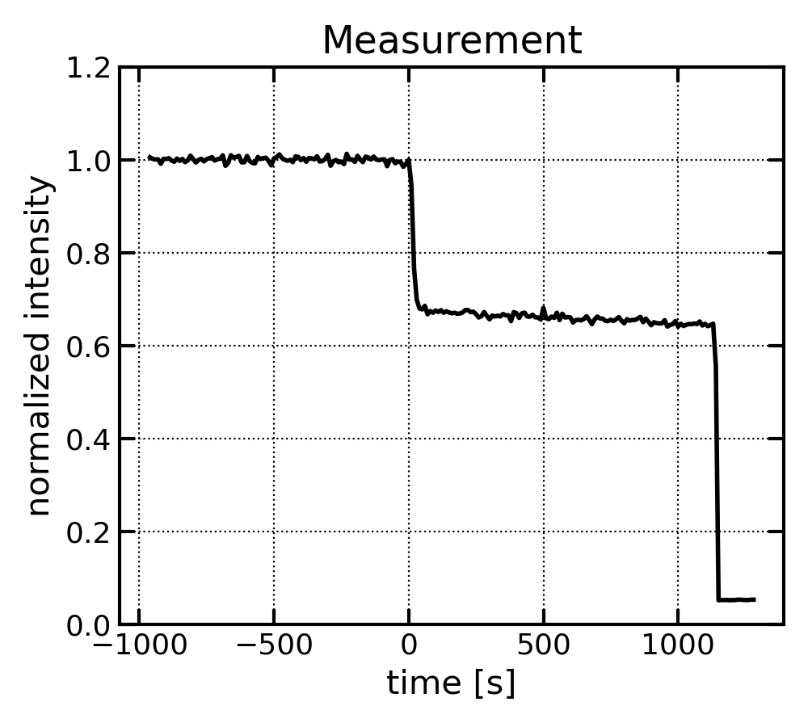
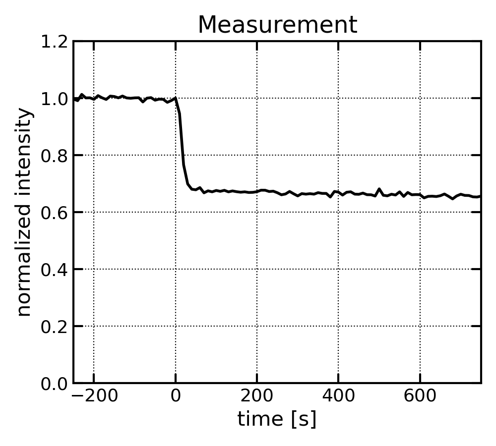
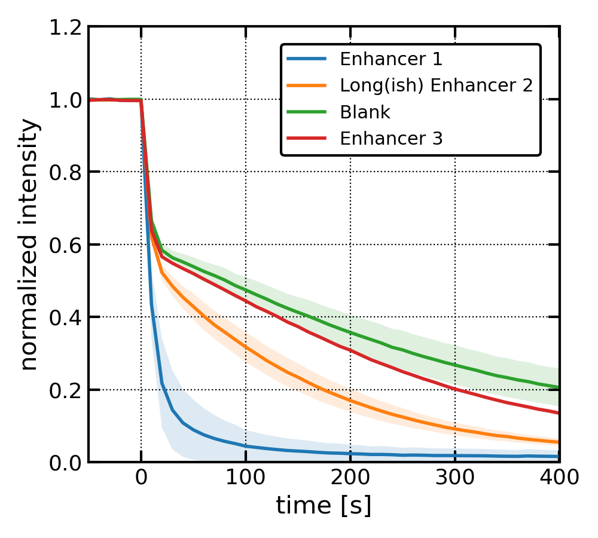
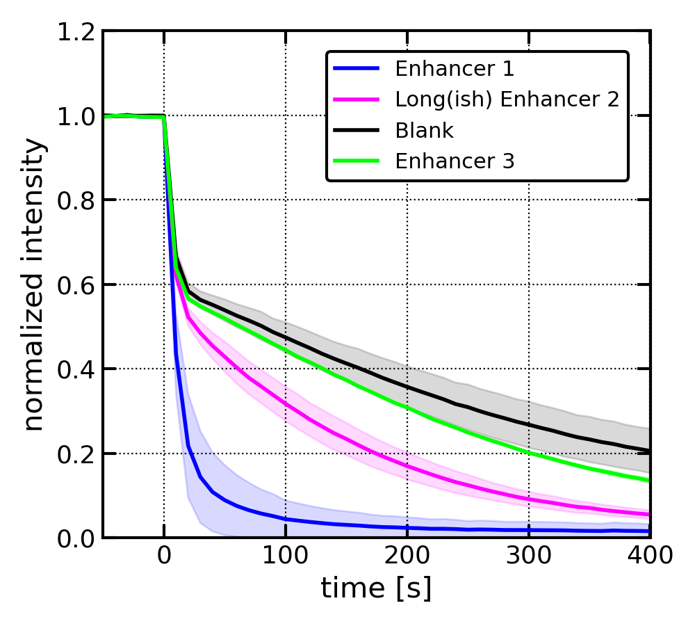

# Plot Scrambling

Script for plotting the results of fluoresence-based dithionite assay for the measurement of scrambling activity.

## Usage

```
./plot_scrambling.sh [-h] [-f DATAFORMAT] [-t TIMERANGE] [-c COLORS] [-o OUTPUT_FILE] [Measurements file]
```
or
```
bash plot_scrambling.sh [-h] [-f DATAFORMAT] [-t TIMERANGE] [-c COLORS] [-o OUTPUT_FILE] [Measurements file]
```

## Measurements file

The script expects one positional argument that specifies the path to the Measurements file. If this path is not provided, the script will attempt to read the file `Measurements` in the directory from which it is called.

The Measurements file should contain a list of blocks initiated by the '>' symbol, followed by a short description ("block name") that will be used to construct the legend. The description should preferably be under 20 characters.


Example:
```
> Protein ABC
```

The subsequent lines specify individual measurements for this block. Each line must contain (1) the path to a file containing the measured data and (2) the time at which dithionite was added (in seconds). The intensity of the signal measured between the start of the experiment and the addition of dithionite is used for signal normalization.

Example:
```
measurement1.dat 180
measurement2.dat 170
```

It is recommended to use the time just *before* the signal starts to drop as the time of dithionite addition. Providing the correct time of dithionite addition is especially important when using multiple measurements in a block.

All measured data are shifted such that the addition of dithionite is at time 0. The measurements from the same block are averaged and plotted as a single line with shading specifying ± 1 standard deviation from the mean. All individual blocks are plotted on a single chart.

Refer to the `examples` directory for sample Measurements files.

### Advanced timing information

Timing information can be supplemented with the time that should be used as the start of the experiment. In this case, the measurement line should follow the format:

```
{PATH_TO_FILE} {START_TIME}-{DITHIONITE_ADDITION}
```

Example:
```
measurement1.dat 50-180
measurement2.dat 50-170
```

If the time of the experiment's start is provided, normalization will be based on the intensity of the signal between `START_TIME` and `DITHIONITE_ADDITION`. This can be useful when there are significant signal fluctuations at the beginning of the measurement.

## Supported data formats

The script has automatic recognition and reading capabilities for files written in the FluorEssence format or any of the three EzSpec formats (DataPoints, EzSpecCompatible, TableHeaderData).

To enforce a specific data format, you can use the option `-f`/`--format`.

Example:
```
./plot_scrambling.sh M_ezspec -f ezspec
```

This command will make the script treat *all* data files provided in the `M_ezspec` Measurements file as if they were written in the EzSpecCompatible format.

Supported keywords (case insensitive):
```
fluoressence    FluorEssence format
datapoints      EzSpec DataPoints format
ezspec          EzSpecCompatible format
tableheader     EzSpec TableHeaderData format
```

Specifying the `-f`/`--format` option should not be necessary, ever.

## Specifying the output

The script generates a PNG file that contains the plotted results. By default, this PNG file is created in the directory where the script is called and is named `scrambling.png`.

To control the name of the output file, you can use the option `-o`/`--output`.

Example:
```
./plot_scrambling.sh M_ezspec -o ezspec.png
```

This command will generate an output file named `ezspec.png`.

## Specifying the time range of the chart

By default, the script plots data for all the times provided in the data files, i.e. for the entire time span of the experiment. The time range can be controlled by using the option `-t`/`--timerange`.

This option expects two integers separated by a comma. The first number should specify the time *before* the addition of the dithionite that should be shown in the chart, while the second number should specify the time *after* the addition of dithionite that should be shown (both in seconds).

For instance, plotting `M_ezspec` measurements from the `examples` directory:
```
./plot_scrambling.sh M_ezspec
```
will generate this chart:


*Note that there is no shading as only one measurement has been provided in the block.*

If the `timerange` option is provided:
```
./plot_scrambling.sh M_ezspec -t 250,750
```

the chart will look like this:


## Specifying the colors of the lines

By default, the script uses the default pyplot colors to plot the individual lines in the chart. If there is only one line, it will be displayed in black.

To control the colors used, you can use the `-c`/`--colors` option.

This option expects a string of colors separated by commas. Each color will be assigned to the corresponding block in the Measurements file, following the order specified.

For instance, plotting `Measurements` from the `examples` directory without specifying colors:
```
./plot_scrambling.sh Measurements -t 50,400 -o fluoressence_default.png
```
will generate this chart:


*Note that there IS shading specifying error (± 1 std) as multiple measurements have been provided in each block.*

If the `colors` options is provided:
```
./plot_scrambling.sh Measurements -t 50,400 -c blue,magenta,black,lime -o fluoressence_colors.png
```
the chart will look like this:


Note that a color must be provided for each block. If only one color is given, it will be used for all blocks.

You can also use hexadecimal codes to specify colors (e.g., `#7ef542,#42b6f5,#cb42f5,#f5bc42`). If you choose to use hexadecimal codes, make sure to enclose the color specification in quotes:
```
./plot_scrambling.sh Measurements -t 50,400 -c '#7ef542,#42b6f5,#cb42f5,#f5bc42'
```

## Chart legend

If only one block of measurements is provided, no legend will be generated. Instead, the name of the block will be used as the chart's title.

When multiple blocks of measurements are provided, a legend will be generated and placed in the upper right corner of the chart. The block names specified in the Measurements file will be used as labels for the individual plotted lines.

Currently, there is no option to control the position of the legend.

## Disclaimer

The script is specifically written for RoVa Lab computers and uses `anaconda3` module from the `Infinity` environment. It will not work anywhere else without modifications.